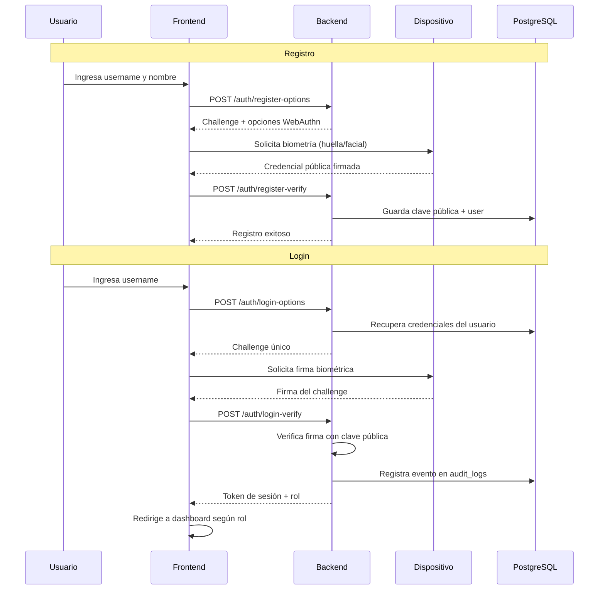

# Login_bio_Seguro_SWSEGURO2026

Sistema de **autenticación biométrica inherente** basado en WebAuthn, desarrollado siguiendo las mejores prácticas de seguridad del **NIST SSDF (Secure Software Development Framework)**.

## 🔐 Descripción

Login_bio_Seguro es una aplicación full-stack que implementa autenticación biométrica sin contraseñas, utilizando las capacidades nativas de los dispositivos (huella dactilar, reconocimiento facial, Windows Hello, Touch ID, Face ID) a través del estándar **WebAuthn**.

### Características Principales

- ✅ **Autenticación biométrica sin contraseñas** - Mayor seguridad y mejor experiencia de usuario
- 🔒 **Cifrado de extremo a extremo** - Las credenciales biométricas nunca salen del dispositivo
- 🛡️ **Protección contra ataques de repetición** - Implementa contadores y challenges únicos
- 📊 **Sistema de auditoría** - Registro completo de eventos de acceso (NIST RV.1)
- 👥 **Control de acceso basado en roles** - Permisos diferenciados para admin y cliente
- 🐳 **Despliegue con Docker** - Configuración lista para producción

---

## 🏗️ Arquitectura

```
Login_bio_Seguro_SWSEGURO2026/
├── backend/              # API REST - Node.js/Express
│   ├── src/
│   │   ├── adapters/     # Middlewares (autenticación, auditoría)
│   │   ├── core/         # Modelos de dominio
│   │   ├── infrastructure/ # Conexión DB, repositorios
│   │   └── use_cases/    # Lógica de registro y login WebAuthn
│   └── main.js           # Punto de entrada del servidor
│
├── frontend/             # Interfaz de usuario - React + Vite
│   ├── src/
│   │   ├── components/   # Login y componentes reutilizables
│   │   ├── views/        # Dashboard
│   │   └── services/     # Cliente de autenticación WebAuthn
│   └── index.html
│
├── db/
│   └── init.sql          # Esquema de base de datos PostgreSQL
│
├── docker-compose.yml    # Orquestación de servicios
└── .env                  # Variables de entorno (DB credentials)
```

### Flujo de Autenticación



---

## 🛠️ Stack Tecnológico

### Backend
- **Node.js** v18+ con Express 5
- **@simplewebauthn/server** v13 - Implementación WebAuthn
- **PostgreSQL** 15 - Base de datos relacional
- **pg** - Cliente PostgreSQL para Node.js
- **dotenv** - Gestión de variables de entorno
- **CORS** - Configuración de política de origen cruzado

### Frontend
- **React** 19 - Biblioteca de interfaz de usuario
- **Vite** 7 - Build tool y dev server
- **@simplewebauthn/browser** v13 - Cliente WebAuthn
- **Axios** - Cliente HTTP
- **CSS** moderno con variables y animaciones

### Infraestructura
- **Docker** & **Docker Compose** - Contenedorización
- **PostgreSQL** 15 Alpine - Imagen ligera de base de datos
- **Nginx** (en contenedor frontend) - Servidor web para producción

---

## 🎯 Quick Start - Primera Ejecución

¿Primera vez con el proyecto? Sigue estos pasos para tenerlo funcionando en menos de 5 minutos:

### 1️⃣ Preparación

```bash
# Clonar el repositorio
git clone https://github.com/JoseSanmartin1999/Login_bio_Seguro_SWSEGURO2026.git
cd Login_bio_Seguro_SWSEGURO2026
```

### 2️⃣ Verificar requisitos

Asegúrate de tener instalado:
- ✅ Docker Desktop
- ✅ Un dispositivo con biometría (huella, Face ID, Windows Hello) o PIN configurado

```bash
# Verificar versiones
docker --version
docker-compose --version
```

### 3️⃣ Configurar variables de entorno

El archivo `.env` ya existe en la raíz del proyecto. Verifica que contenga:

```env
DB_USER=admin_bio_user
DB_PASSWORD=adminstrador123
DB_NAME=login_bio_db
DB_HOST=db
DB_PORT=5432
```

> Si usas desarrollo local (sin Docker), cambia `DB_HOST=db` a `DB_HOST=localhost`

### 4️⃣ Levantar el proyecto

```bash
# Iniciar todos los servicios (base de datos, backend, frontend)
docker-compose up --build
```

**Espera a ver estos mensajes:**
```
✅ db_login_bio_seguro    | database system is ready to accept connections
✅ backend_login_bio      | 🚀 Servidor Login_bio_Seguro_SWSEGURO2026 en puerto 3000
✅ frontend_login_bio     | ready in X ms
```

### 5️⃣ Abrir la aplicación

Abre tu navegador en: **http://localhost:5173**

### 6️⃣ Registrar tu primer usuario

1. Haz clic en **"¿No tienes cuenta? Regístrate aquí"**
2. Completa:
   - **Username**: `admin` (o el que prefieras)
   - **Nombre completo**: Tu nombre
   - **Rol**: `Administrador`
3. Haz clic en **"Registrar y Vincular Biometría"**
4. Autoriza con tu huella/Face ID/Windows Hello
5. ¡Listo! Ya puedes iniciar sesión

### 7️⃣ Iniciar sesión

1. Ingresa tu username (ej: `admin`)
2. Haz clic en **"Iniciar Sesión con Biometría"**
3. Autoriza nuevamente con tu biometría
4. Accederás al dashboard

---

## 🛑 Detener el proyecto

```bash
# Ctrl + C en la terminal donde corre docker-compose
# O ejecuta:
docker-compose down
```

---

## 📋 Requisitos Previos

- **Docker** >= 20.10
- **Docker Compose** >= 2.0
- **Node.js** >= 18.x (para desarrollo local)
- **npm** >= 9.x
- Dispositivo con capacidades biométricas (huella digital, reconocimiento facial) o **Windows Hello** / **PIN**

---

## 🚀 Instalación y Ejecución

### Opción 1: Con Docker (Recomendado)

1. **Clonar el repositorio**
   ```bash
   git clone https://github.com/JoseSanmartin1999/Login_bio_Seguro_SWSEGURO2026.git
   cd Login_bio_Seguro_SWSEGURO2026
   ```

2. **Configurar variables de entorno**
   
   Verifica que el archivo `.env` en la raíz tenga:
   ```env
   DB_USER=admin_bio_user
   DB_PASSWORD=adminstrador123
   DB_NAME=login_bio_db
   DB_HOST=db
   DB_PORT=5432
   ```

3. **Levantar los servicios con Docker Compose**
   ```bash
   docker-compose up --build
   ```

4. **Acceder a la aplicación**
   - Frontend: http://localhost:5173
   - Backend API: http://localhost:3000
   - Base de datos: `localhost:5432`

### Opción 2: Desarrollo Local

#### Backend
```bash
cd backend
npm install
node main.js
```
El servidor estará en `http://localhost:3000`

#### Frontend
```bash
cd frontend
npm install
npm run dev
```
La interfaz estará en `http://localhost:5173`

#### Base de Datos
```bash
docker-compose up db
```
O usa PostgreSQL instalado localmente y ejecuta `db/init.sql`

---

## 📖 Uso

### Registro de Nuevo Usuario

1. Abre la aplicación en tu navegador
2. Haz clic en **"¿No tienes cuenta? Regístrate aquí"**
3. Completa el formulario:
   - **Username**: Tu nombre de usuario único
   - **Nombre Completo**: Tu nombre real
   - **Rol**: Selecciona `Cliente` o `Administrador`
4. Haz clic en **"Registrar y Vincular Biometría"**
5. El navegador solicitará autenticación biométrica de tu dispositivo
6. Una vez registrado, serás redirigido al login

### Inicio de Sesión

1. Ingresa tu **username**
2. Haz clic en **"Iniciar Sesión con Biometría"**
3. Autentica con tu huella dactilar / reconocimiento facial
4. Accederás al dashboard según tu rol:
   - **Admin**: Opciones de auditoría y gestión
   - **Cliente**: Vista de perfil restringida

---

## 🗄️ Esquema de Base de Datos

### Tabla `users`
| Columna | Tipo | Descripción |
|---------|------|-------------|
| id | UUID | Identificador único del usuario |
| username | VARCHAR(50) | Nombre de usuario (único) |
| full_name | VARCHAR(100) | Nombre completo |
| role | VARCHAR(20) | Rol: 'admin' o 'cliente' |
| created_at | TIMESTAMP | Fecha de creación |

### Tabla `authenticators`
| Columna | Tipo | Descripción |
|---------|------|-------------|
| id | UUID | Identificador único |
| user_id | UUID | Referencia al usuario |
| credential_id | BYTEA | ID único del dispositivo |
| public_key | BYTEA | Clave pública para verificar firmas |
| sign_count | INTEGER | Contador anti-replay |
| created_at | TIMESTAMP | Fecha de vinculación |

### Tabla `audit_logs`
| Columna | Tipo | Descripción |
|---------|------|-------------|
| id | SERIAL | Identificador único |
| user_id | UUID | Usuario que realizó la acción |
| action | TEXT | Tipo de acción (LOGIN_SUCCESS, etc.) |
| ip_address | VARCHAR(45) | IP del cliente |
| user_agent | TEXT | Navegador/dispositivo |
| timestamp | TIMESTAMP | Momento del evento |

---

## 🔒 Seguridad - Cumplimiento NIST SSDF

Este proyecto implementa prácticas del **NIST Secure Software Development Framework**:

| Recomendación | Implementación |
|---------------|----------------|
| **PW.2** - Authenticación Multi-Factor | WebAuthn con biometría inherente al dispositivo |
| **PW.4** - Protección contra Replay | Counters y challenges únicos por sesión |
| **RV.1** - Auditoría y Monitoreo | Tabla `audit_logs` con registro de eventos |
| **PO.1** - Privilegio Mínimo | Control de acceso basado en roles (RBAC) |

### Buenas Prácticas Implementadas

- ❌ **No se almacenan contraseñas** - Solo claves públicas criptográficas
- ❌ **No se almacenan datos biométricos** - La biometría nunca sale del dispositivo
- ✅ **HTTPS requerido** - WebAuthn solo funciona en contextos seguros
- ✅ **Validación de origen** - Verifica que las peticiones vengan del dominio correcto
- ✅ **Cifrado en base de datos** - PostgreSQL con extensión pgcrypto

---

## 🧪 Endpoints de la API

### Autenticación

#### `POST /auth/register-options`
Solicita opciones de registro WebAuthn
```json
{
  "username": "jose.admin",
  "fullName": "Jose Sanmartín"
}
```

#### `POST /auth/register-verify`
Verifica y completa el registro
```json
{
  "body": { ...attestationResponse },
  "username": "jose.admin",
  "fullName": "Jose Sanmartín",
  "role": "admin"
}
```

#### `POST /auth/login-options`
Solicita challenge de login
```json
{
  "username": "jose.admin"
}
```

#### `POST /auth/login-verify`
Verifica la firma biométrica
```json
{
  "body": { ...assertionResponse },
  "username": "jose.admin"
}
```

### Dashboards (Protegidos)

#### `GET /api/admin/dashboard`
- **Requiere**: Rol `admin`
- **Respuesta**: Opciones de administración

#### `GET /api/cliente/dashboard`
- **Requiere**: Rol `cliente` o `admin`
- **Respuesta**: Opciones de cliente

---

## 🐛 Troubleshooting

### Error: "Cannot find module './src/infrastructure/UserRepository'"
**Solución**: El archivo tenía un typo. Debe ser `UserRepository.js` (no `UserRepositiry.js`)

### Error 500 en /auth/register-options
**Causa**: `@simplewebauthn/server` v13 requiere `userID` como `Uint8Array`
**Solución**: Usar `new Uint8Array(Buffer.from(username))` en lugar de `.toString('base64')`

### WebAuthn no funciona
**Requisitos**:
- Conexión HTTPS (o localhost para desarrollo)
- Dispositivo con biometría habilitada (o PIN/Windows Hello)
- Navegador compatible: Chrome 67+, Firefox 60+, Safari 13+, Edge 18+

---

## 👥 Autor

**Jose Sanmartín** - Proyecto de Software Seguro 2026
- Universidad: ESPE (Escuela Politécnica del Ejército)
- GitHub: [@JoseSanmartin1999](https://github.com/JoseSanmartin1999)

---

## 📄 Licencia

Este proyecto fue desarrollado con fines educativos para la asignatura de Software Seguro.

---

## 🔗 Referencias

- [WebAuthn Specification](https://www.w3.org/TR/webauthn/)
- [NIST SSDF SP 800-218](https://csrc.nist.gov/publications/detail/sp/800-218/final)
- [SimpleWebAuthn Documentation](https://simplewebauthn.dev/)
- [OWASP Authentication Cheat Sheet](https://cheatsheetseries.owasp.org/cheatsheets/Authentication_Cheat_Sheet.html)
